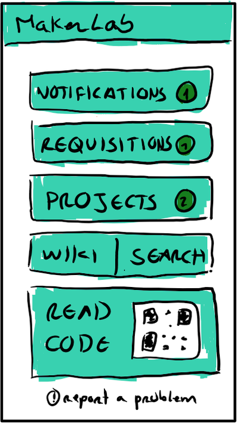
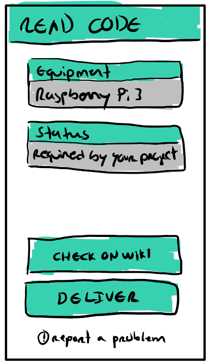
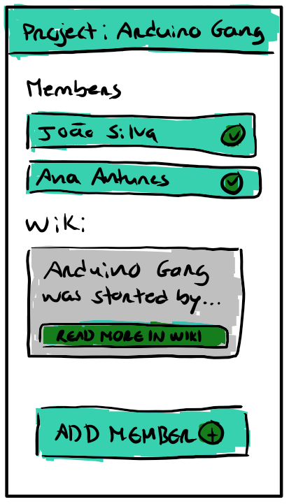
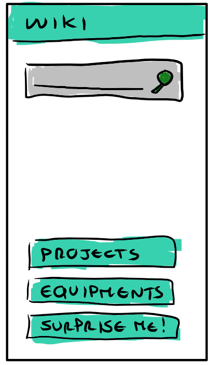

## #16

The week started with the first "full project" demo. Its our opinion that
everything went mostly well. We received good feedback, and had the opportunity
to discuss ideas with many different professors and visitors, which enabled us
to collect relevant features that we decided to include.

So what have we been working on?

We implemented a big portion of these features. They were mostly small things,
such as displaying this information in this page, of that graph in that other
place. We did it.

We also configured a mail agent, so that we can now send email
@deti-makerlab.ua.pt! This also means that we can start sending emails logging
requisitions and all those other niceties we had been talking about for so
long.

New endpoints to the servant were also added, giving answer to the (also) new
endpoints of the NetworkManager (namely port's management).

Oh, and we also developed a nice poster for the students@deti event.

There's still a not so small path till we can see this project's completion,
though we are heading full power mode aiming towards a strong finish!

*Published at 28-05-2017*

-------------------------------------------------------------------------------

## #15

We are still building up towards the projects completion.

Missing features have been decreasing at a steady state, and most things are
thus slowing down development. It is starting to become about the little
details at this point.

As an example, the servant + network not only now communicate reasonable well,
as they also start to worry about the way they output information to the
outside world, in a pretty and informative way.

Some improvements were made in our algorithm to measure the average people in the
room during the day.

We are adding features, improving old ones and bug-fixing errors that appear
along the way. We are building towards DETI MakerLab completion one step at a
time (now aiming to the soon to come full demo).

*Published at 21-05-2017*

-------------------------------------------------------------------------------

## #14

Things have been closing during the last week (and will continue to do so).

No new features are being accepted and schedule for development, now the
main focus being to have everything working as soon as possible.

For reference:
* The wiki is mostly OK. Until the apps are completed we can't really call it
  closed, but not much remains to do. The exception including features
  regarding groups of users and sending email logs.
* The Android app has received a major visual refactor, and now looks quite
  good. Apart from a few set of views, is mostly complete.
* The iOS app halted development a few time ago... Though now trying to pick
  up again, the team is unsure whether this will be possible.
* Network - still needs to be integrated. This should have been done earlier,
  but people keep on pushing the schedule. We'll see.
* Counting people - needs results, but should be done within one to two days.
* Others: might need changes pushed by the other components that are not yet
  closed. Apart from this, they should be OK.

Also, we have recently found another use case for one of our components
(servant) in an IT's project. This is being written in the team's log since it
shows that one of the project's goals (the possibility of using its components
outside the project's scope) is in fact a reality --- this being the first
example of a situation where this will be done.

*Published at 14-05-2017*

-------------------------------------------------------------------------------

## #13

This week saw little development, after last weeks tight schedules we had to
turn our attention into other matters. Thus, to reduce having some team
members waiting on others at different moments, the whole team took the time
to work on things that needed the time, even if out of scope of this project.

We hope to have some interesting news soon.

*Published at 07-05-2017*

-------------------------------------------------------------------------------

## #12

We have started integrating the Network Manager (NM) with its public interface
(chatbot). The network manager had also to be changed. While we were expecting
a switch with VXLAN capabilities, we now will only be capable of using one
without. This meant refactoring the overall network architecture, but things
should proceed without much fuzz.

Our Android app also saw visual improvements, and we are back on track with
the requisition platform (after that last minute change we were imposed).

As an addition, we have also started experimenting with ideas for people
counting. We expect to have it working soon.

*Published at 30-04-2017*

-------------------------------------------------------------------------------

## #11

This was an interesting week.

First and foremost we had another milestone (M4) to prepare, which burdened us
with the creation of another presentation and demo. It's the group's opinion
that everything went mostly fine and we are happy with the outcome.

Pressured by the milestone we also got authentication with UA working;
connections through HTTPS done (this was already completed, except for the
integration with mobile apps since we use a self-signed certificate); and
requisitions mostly completed (or so we thought).

Not all roses though... When we went to deploy the system, we found out that a
previously discussed matter turned out to be an issue. Long story short, we
were first asked to consider individual units of equipments, whereas now units
don't exist. I repeat, this had been discussed with both parties (manager and
administrator), it was not lack of planning.

Hopefully we anticipate that the damage can be mostly repaired within a week,
it is just unpleasant to have to fix something that should have never been
broken.

Now onto the future: This week (12) we begin phase 3 of project development.
This means we will begin integrating the datacenter (currently supporting the
creation of VMs), as well as developing some new, different things (aside from
maintaining what has already been developed/deployed).

As a sneak peek, we have planned the development of a "How many people in the
room?" feature, as well as having the chatbot handling the interface with the
datacenter's management API.

*Published at 23-04-2017*

-------------------------------------------------------------------------------

## #10

This week was a lot about improving the project's documentation (feel free to
go on an check the [specifications](/specification/introduction/).

We also got a development server set up, so that we can use it to test
features before releasing them into production. With it we tested and have
already deployed:
* Communications over HTTPS;
* Having both our wiki engine and our Solr's instance running behind uwsgi and
  nginx;
* Got a few servant's features introduced (such as a ping-like command).
This is not meant to be an extensive list.

*Published at 16-04-2017*

-------------------------------------------------------------------------------

## #9

Easter took us most time.

This week saw little development, with the main focus being on fixing things
and preparing for future work.

*Published at 09-04-2017*

-------------------------------------------------------------------------------

## #8

We now have an assistant - `dml-servant` - the chatbot that will help us
managing DETI's MakerLab. For now, it provides simple endpoints that are
mostly funny but not really useful (e.g. a way to annoy some other users),
however its main goal is to automate some tasks made by the lab users and also
by us. Regarding the users, we will focus on endpoints given special
functionality for the IT students.

UA's auth system is also mostly finished, enabling us to use each user's UU to
login and get their profile information (effectively, from the standpoint of
the users, eliminating the need for yet another account to keep track of).

We have also migrated our services to the STIC's VM, and Sr. Arez has started
to fill in the wiki with some information. This enables us to test what we
were missing, making it possible to schedule the releases we have been holding
on. Expect big updates soon, although we will also be busy documenting
everything.

*Published at 02-04-2017*

-------------------------------------------------------------------------------

## #7

After some headaches we have finally came up with a proper architecture for
structuring our data.  
We developed a parser which solves the flexibility requirements imposed by one
of our clients, which demanded general "management" information to be directly
editable as if it was any other kind of content of an article. Here goes how
it looks like:

This step was necessary since now the mobile apps will start to actually
communicate with the API, and they definitely don't want to face all the
complexity (imposed by the system's flexibility, one of its requirements) of
our data structure. We have added a new page on the issue [here](../../developer/developer-area/).

On other news, we are still waiting to have items added onto the wiki. We will
have to ask prof. Diogo Gomes to pressure Sr. Arez so that we can have
actual items to test with.

Hopefully, though, the STIC have finally delivered us our server (although
with an odd name). During the next few days we will start migrations, although
we expect things to go smoothly (it now feels good to be using Docker, since
most things are automatic).

*Published at 26-03-2017*

-------------------------------------------------------------------------------

## #6

Although there's still some polishing to do, after a few attempts and some
headaches we now can "fast" print a set of custom labels, which include our
codes. This will hopefully simplify a lot the life of Sr. Arez, who otherwise
would have to print one label by one.

Also, improving last week's release (adding equipments to the wiki), we have
released a new feature when adding units so that it's easy to add multiple
units belonging to a given equipment.

On other news, everything is mostly ready to support requisitions. We are
simply waiting to have items on the wiki so that we can test our new features
before releasing them to public. With the improvements above, hopefully these
shouldn't take too long.

*Published at 19-03-2017*

-------------------------------------------------------------------------------

## #5

First partial release of the platform!

This week brought many news. On the one hand, there was the first project's
presentation, where we presented our overall architecture of the system and
its scheduled features. On the other hand, we delivered "half" of the
platform, by now permitting Sr. Arez (DETI Makerlab's staff) to start adding
news equipments to the wiki.

We've also come to conclude that we will develop both an extra component, a
parser, to better integrate with prof. Diogo's vision of how the system should
behave, as well as a simple utility to facilitate Sr. Arez product labelling
workflow. Hopefully these will not consume much time.

As a side effect of the team's presentation, we now feel we have a much more
crystallised vision of the system and a map of how things will fit together.
As an example, the plugin-based section of the architecture is pretty much
established, contrary to what used to be true.

Yet, we've once again stomped on the network's section. What we thought was to
be done in Layer 3 will be Layer 2, which further pushed the network's
delivery schedule.

Next week: Requisitions!

*Published at 12-03-2017*

-------------------------------------------------------------------------------

## #4

As promised, this week's major update/upgrade is the site's refactor. It is
now much better, much prettier, user friendlier and useful all around. It's
unrecognisable.

Also, our wiki finally dropped SQLite (which was being used for
development/testing purposes) for a Postgres container.

With the most recent wiki updates, we are close to being capable of releasing
the *Phase 1* of the wiki's delivering schedule. We hope this is possible next
week. By then we will also start adding images (like print screens and such)
to these devlogs.

*Published at 05-03-2017*

-------------------------------------------------------------------------------

## #3

We started launching containers!

Although still far from complete and not even open to public, this was the
first time we were capable of launching VMs programmatically.

We also scheduled a major front-page refactor, which will hopefully make our
site's front page much friendlier and useful.

On other news, our wiki went from english to portuguese, at least for its
first version. This also meant start indexing articles in portuguese. This is
mostly solved now.

*Published at 26-02-2017*

-------------------------------------------------------------------------------

## #2

During this week Milestone 1 (M1) was prepared.

This took some time from our schedules, which meant we could progress as much
as we would have liked.

Despite this, a general architecture was proposed accompanied by a draft of
our API; Solr's readings and learning were closed and actual work can begin.

The template of our project's site was also changed, so that it could better
fit its documentation purposes. It is quite different now.

Some mockups for the mobile app were also prepared:

{:width="180px"}
{:width="180px"}
{:width="180px"}
{:width="180px"}
{:width="180px"}
{:width="180px"}
{:width="180px"}
{:width="180px"}
{:width="180px"}
{:width="180px"}
{:width="180px"}
{:width="180px"}

*Published at 19-02-2017*

-------------------------------------------------------------------------------

## #1

Project was started. The team met and momentum picked up.

We also met with our mentor, which enlightened us with is vision of the
project.

Each of us was assigned an initial role, so that we could start reading and
investigating what to do.

-------------------------------------------------------------------------------
*Published at 12-02-2017*

{::comment}
## Week 17 (04-06-2017)
{:/comment}
